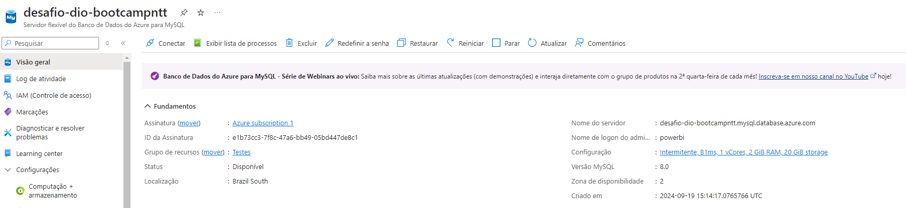
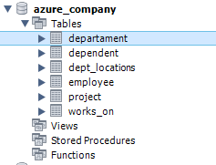
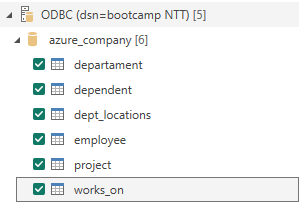
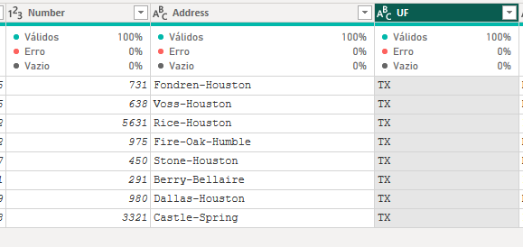
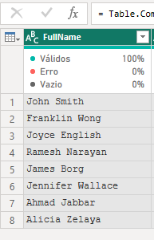
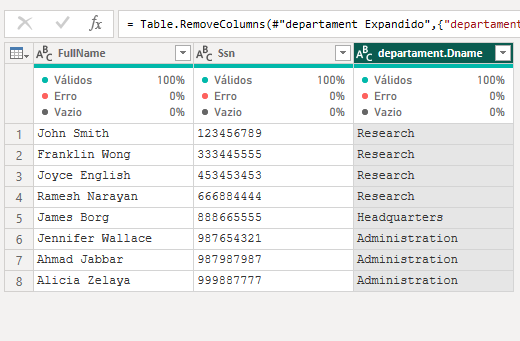
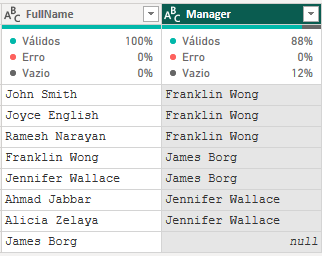
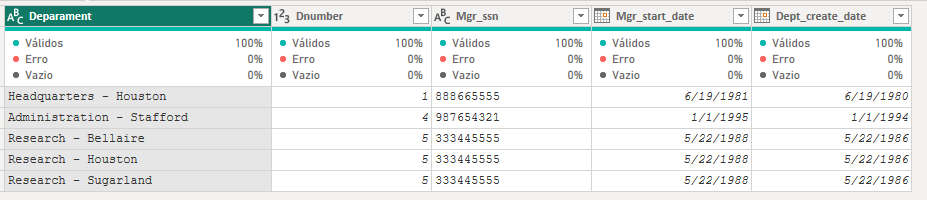
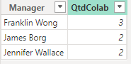

# Criando um Dashboard corporativo com integração com MySQL e Azure

Descrição do desafio módulo 3 – Processamento de Dados Simplificado com Power BI

1. Criação de uma instância na Azure para MySQL - OK
    
2. Criar o Banco de dados com base disponível no github - OK
    
    

3. Integração do Power BI com MySQL no Azure - OK

    

4. Verificar problemas na base a fim de realizar a transformação dos dados
   
    Ao fazer a transformação de dados não foi encontrada nenhuma inconsistencia ao transformar os dados.

-----------------------------------------------------------------------------

1. Verifique os cabeçalhos e tipos de dados

Tudo ok

2. Modifique os valores monetários para o tipo double preciso

OK

3. Verifique a existência dos nulos e analise a remoção

Foi encontrado apenas uma instancia com o valor nulo na tabela employee, Não há a necessidade da remoção, devido ele ser um chefe. mas efetuei a alteração para 000000000

4. Os employees com nulos em Super_ssn podem ser os gerentes. Verifique se há algum colaborador sem gerente

Não há colaboradores sem gerentes.

5. Verifique se há algum departamento sem gerente

Não.

6. Se houver departamento sem gerente, suponha que você possui os dados e preencha as lacunas

7. Verifique o número de horas dos projetos

Foi identificado que o numero de horas está com um formato estranho quando falamos de horas quebradas, por exemplo 32.5 que seria 32 horas e 30 minutos. Porem no powerbi não foi possivel realizar essa interpretação.

8. Separar colunas complexas

9. Mesclar consultas employee e departament para criar uma tabela employee com o nome dos departamentos associados aos colaboradores. A mescla terá como base a tabela employee. Fique atento, essa informação influencia no tipo de junção

10. Neste processo elimine as colunas desnecessárias.

11. Realize a junção dos colaboradores e respectivos nomes dos gerentes . Isso pode ser feito com consulta SQL ou pela mescla de tabelas com Power BI. Caso utilize SQL, especifique no README a query utilizada no processo.

Query

SELECT CONCAT(e.Fname, ' ', e.Lname) as 'Full Name', CONCAT(e2.Fname, ' ', e2.Lname) as 'Manager'
FROM employee e
JOIN employee e2 on e.Super_ssn = e2.Ssn

12. Mescle as colunas de Nome e Sobrenome para ter apenas uma coluna definindo os nomes dos colaboradores

13. Mescle os nomes de departamentos e localização. Isso fará que cada combinação departamento-local seja único. Isso irá auxiliar na criação do modelo estrela em um módulo futuro.

14. Explique por que, neste caso supracitado, podemos apenas utilizar o mesclar e não o atribuir.

Utilizamos o mesclar devido a necessidade de fazer um "join" nos dados, assim podendo depois unificar o departamento e a localização.

Se utilizarmos o atribuir ele irá considerar como linhas distintas, o que não ficaria legal para os nossos dados.

15. Agrupe os dados a fim de saber quantos colaboradores existem por gerente

16. Elimine as colunas desnecessárias, que não serão usadas no relatório, de cada tabela
